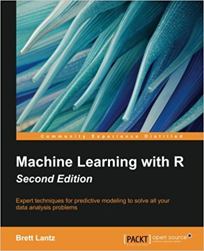

# Machine Learning with R - Lantz 

 
 

This repository contains R code and raw data for practice of  "Machine Learning with R - 2nd Edition 2015 Lantz".

* Contents
	- k-NN
	- Naive Bayesian
	- Decision Tree
	- Rule Learner (RIPPER)
	- Regression
	- Random Forest
	- Support Vector Machine
	- Neural Networks
	- Association Rule
	- k-Means

 